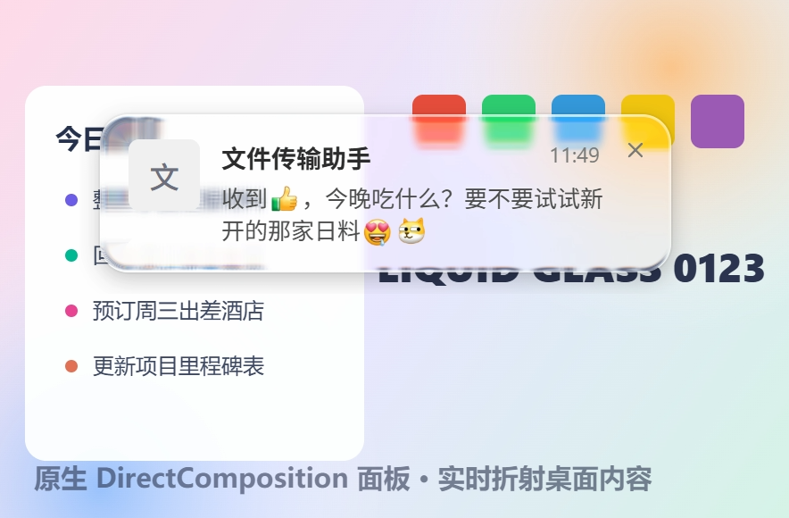

# Electron-Liquid-Glass

Windows 全局原生低延迟「液态玻璃」背景面板，for Electron。

Low-latency native liquid glass backdrop panels for Electron apps, powered by DXGI Desktop Duplication + D3D11 + DirectComposition.

把液态玻璃渲染为一个全局独立的原生窗口，放在你的 Electron 窗口正下方作为实时背景层。



> 真实渲染截图（非合成图）：通知卡片为 Electron 透明窗口，卡片背后的折射、模糊、色散与驱动文字反色的亮度采样全部来自本模块的原生面板。注意玻璃上缘被折弯的色块、左缘弯曲的待办文字与下缘扭曲的大字。

## 特性

- **真折射，非毛玻璃**：圆角矩形 SDF 透镜位移，边缘可见清晰的背景折射与色散，中心通透
- **6ms 级响应**：DXGI 零拷贝拿 GPU 桌面纹理，D3D11 渲染，DirectComposition 直接上屏，全程不落 CPU
- **深度节能**：事件驱动——桌面不动不画、脏区不相交不画、无面板自动休眠
- **自适应反色支持**：内置亮度带采样（均值色 + luma p15/p85），重绘驱动、与画面同帧推送（上限 ~60Hz），驱动上层文字明暗自适应
- **z 序锚定**：面板自动钉在指定 Electron 窗口正下方，并周期性重申（防其他置顶窗口插队）
- **防自采集回环**：`WDA_EXCLUDEFROMCAPTURE` 把面板从一切屏幕捕获中排除
- **零 Electron 侵入**：纯 N-API 原生模块 + 命令队列，跨 Electron 版本 ABI 稳定，任何 Electron 应用可直接接入

## 原理

```
DXGI Desktop Duplication（零拷贝 GPU 桌面纹理，仅画面变化时出帧）
  → D3D11 三趟着色（半分辨率可分离高斯模糊 ×2 → 圆角 SDF 透镜位移 + RGB 色散 + 饱和度 + 圆角 AA）
  → DirectComposition 预乘 alpha 交换链直接上屏（不经过 DWM 重定向位图）
```

- 全链路在一个独立工作线程 + GPU 上完成，无像素跨进程/跨线程拷贝
- 面板窗口 `WS_EX_NOREDIRECTIONBITMAP + WS_EX_TRANSPARENT + WS_EX_NOACTIVATE`（鼠标穿透、不抢焦点、不进任务栏）
- JS 侧所有调用经命令队列异步投递到工作线程，天然线程安全
- 分层协作：本面板负责「玻璃背后的世界」（折射/模糊/色散），你的 Electron 透明窗口负责「玻璃表面」（文字、高光、描边、tint）

```
┌─ Electron 透明窗口（内容层：文字 / 高光 / 边框）─┐   ← 你的应用
│  ┌─ 原生玻璃面板（折射层，钉在正下方）────────┐  │   ← 本模块
│  │      实时折射的桌面背景                    │  │
└──┴────────────────────────────────────────────┴──┘
```

## 系统要求

| 平台 | 支持状态 |
|---|---|
| Windows 10 2004 (build 19041)+ |  完整支持 |
| Windows 更旧版本 | `isSupported()` 返回 `false`（缺少 `WDA_EXCLUDEFROMCAPTURE`） |
| macOS / Linux | 模块可正常安装加载，`isSupported()` 返回 `false`，请回退到你自己的方案（如 Chromium 桌面流 + WebGL）；macOS 原生后端（ScreenCaptureKit + Metal）在路线图中 |

构建需要：Node.js 18+、VS Build Tools（C++ 桌面工作负载）+ Python（node-gyp 标准要求）。N-API (NAPI_VERSION 8) 构建，跨 Electron / Node 版本 ABI 稳定，无需按 Electron 头文件重编。

## 安装

```bash
# 作为 git 依赖
npm install github:hicccc77/electron-liquid-glass

# 或本地路径（monorepo / 源码调试）
npm install file:../electron-liquid-glass
```

安装时自动 `node-gyp rebuild`。Electron 打包（electron-builder）注意把 `.node` 解包出 asar：

```jsonc
"build": { "asarUnpack": ["**/*.node"] }
```

## 快速上手（Electron 主进程）

```js
const { screen } = require('electron')
const glass = require('electron-liquid-glass')

if (glass.isSupported()) {
  const dpr = screen.getPrimaryDisplay().scaleFactor
  const panel = glass.createPanel({
    // 屏幕物理像素
    x: 1560, y: 40, width: 344, height: 96,
    cornerRadius: 20, blurSigma: 5,
    displacementScale: 70, aberrationIntensity: 2, saturation: 1.4,
    dpr,
    anchorWindow: myToastWindow,          // 面板钉在该 BrowserWindow 正下方
    lumaBands: [                          // 自适应反色的亮度采样带（面板本地物理像素）
      { id: 0, x: 0, y: 0, width: 344, height: 48 },
      { id: 1, x: 0, y: 48, width: 344, height: 48 }
    ],
    onLuma: bands => {
      // bands = { '0': { r, g, b, darkTail, lightTail }, '1': ... }
      // 均值 RGB + luma p15/p85（gamma 域 0~255）。重绘驱动：
      // 背景变化的同一帧推送（上限 ~60Hz），桌面静止时不推送
      // 据此切换上层文字的明暗配色
    }
  })

  panel.show(120)                          // 淡入 120ms
  panel.setBounds({ x, y, width, height }) // 跟随窗口移动/改尺寸
  panel.hide(240)                          // 淡出
  panel.destroy()
} else {
  // 回退：Chromium 桌面流 + WebGL 折射管线，或静态 backdrop-filter
}
```

上层窗口只需把玻璃区域留透明（Electron `transparent: true` 天然满足），自己绘制文字/描边/高光/tint 等内容层，折射背景由本面板提供。

## API

完整类型见 [`index.d.ts`](index.d.ts)。所有面板方法线程安全。

| 方法 | 说明 |
|---|---|
| `isSupported()` | 当前环境是否可用（Windows 10 2004+ 且原生二进制已构建） |
| `createPanel(options)` | 创建面板，返回句柄；不可用时返回 `null` |
| `panel.show(fadeMs?)` / `panel.hide(fadeMs?)` | 淡入 / 淡出（`0` = 立即） |
| `panel.setBounds(bounds)` | 移动 / 改尺寸（物理像素） |
| `panel.setParams(params)` | 更新视觉参数（圆角、模糊、位移、色散、饱和度） |
| `panel.anchor(windowOrHwnd)` | 重新钉到某窗口正下方（接受 `BrowserWindow` 或 HWND Buffer） |
| `panel.setLumaBands(bands)` / `panel.onLuma(cb)` | 更新亮度采样带 / 回调 |
| `panel.destroy()` | 销毁面板 |
| `shutdown()` | 停止工作线程并销毁所有面板 |

## 实测（1080p，动态背景，Windows 11）

| 指标 | Chromium 流方案（getUserMedia + WebGL） | 本模块 |
|---|---|---|
| 感知位置滞后（中位 / p90） | 77ms / 89ms | **6ms / 6ms** |
| 满载 CPU 增量（主+GPU+渲染进程合计） | ~1.5% | **~0.3%** |
| 静止桌面开销 | 持续采集出帧 | **0**（事件驱动） |
| 首帧启动 | ~80-300ms（getUserMedia 协商） | **<150ms**（面板常驻复用后为 0） |
| 40 轮通知压测 | — | 面板 1 建 81 复用，内存零增长，零异常 |

测量方法：同帧差分法——同一帧屏幕采集内对比玻璃呈现内容与背景真值条纹的计数差，两个时间戳均来自绘制时刻，结果与探针自身延迟无关。

## 源码结构

```
src/
├── addon.cc       N-API 绑定层（参数解析、亮度回调线程安全投递）
├── session.cc/h   调度中枢：独占工作线程跑「采集→渲染→上屏」闭环、命令队列、节能策略
├── capture.cc/h   DXGI Desktop Duplication 采集（零拷贝 GPU 纹理 + 脏区）
├── renderer.cc/h  D3D11 三趟玻璃管线 + 亮度带直方图采样
├── panel.cc/h     DirectComposition 无重定向位图窗口、淡入淡出、z 序锚定、捕获排除
├── d3d_utils.cc/h 设备创建辅助
└── addon_stub.cc  非 Windows 桩（isSupported() = false）
```

## 已知限制

- 目前仅 Windows 有原生实现（macOS ScreenCaptureKit + Metal 后端在路线图中，API 已按平台后端可插拔设计）
- 面板排除于截屏/录屏（`WDA_EXCLUDEFROMCAPTURE` 的语义，与内容保护窗口一致）
- 安全桌面（UAC / 锁屏）期间采集暂停，返回后自动恢复
- 多显示器：采集会话跟随首个可见面板所在显示器；跨屏移动面板会自动重建会话

## License

[MIT](LICENSE)
